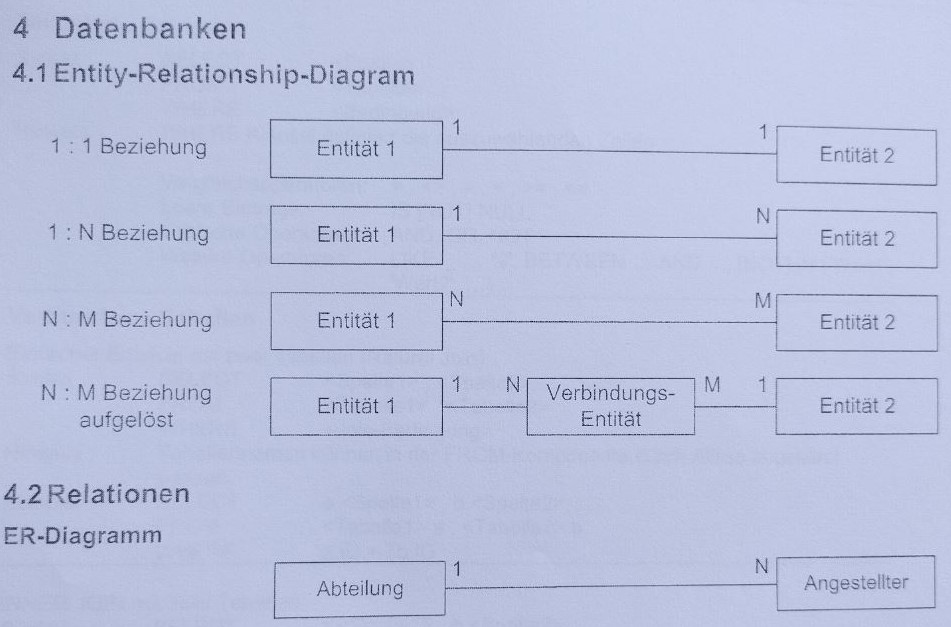

# Ralationales Datenbankmodell
Relationale Datenbanken basieren auf Relationen, die in diesem Kontext als mathematische Beschreibung einer Tabelle dienen.  
Sie basieren also auf Tabellen. 

## Normalformen
Um sinnvoll in einer Datenbank verwendet zu werden, sollten die Tabellen gewissen Standards entsprechen. 
### Erste Normalform
Ein Relationstyp (Tabelle) befindet sich in der ersten Normalform (1NF), wenn die Wertebereiche der Attribute des Relationstypen atomar sind.  
D.h., dass die Werte der Felder untrennbar sein sollten. So sollten wir Ort und PLZ trennen oder auch Name und Vorname.  
Ebenso sollten innerhalb der Felder, eines Tabelleneintrags, keine mehreren Werte stehen. Jeder Wert sollte seinen eigenen Eintag haben, auch wenn das vorerst viel Wiederholung bedeutet.

__Beispiel__:  
Gegeben:
Filmname | Land | Jahr | Darsteller 
--- | --- | --- | ---
Das Schweigen der Lämmer | USA | 1991 | Jodie Foster, Anthony Hopkins, Scott Glenn
Noah | USA | 2014 | Russell Crowe, Anthony Hopkins, Emma Watson

Wird zu:
Filmname | Land | Jahr | Darsteller-Vorname | Darsteller-Name  
--- | --- | --- | --- | ---
Das Schweigen der Lämmer | USA | 1991 | Jodie | Foster
Das Schweigen der Lämmer | USA | 1991 | Anthony | Hopkins
Das Schweigen der Lämmer | USA | 1991 | Scott | Glenn
Noah | USA | 2014 | Russell | Crowe
Noah | USA | 2014 | Anthony | Hopkins
Noah | USA | 2014 | Emma | Watson

__Probleme__:  
Dies führt aber zu weiteren Problemen.  
- Redundanz  
  - Viele Daten wie zb. Filmname, Land, Jahr werden mehrfach gespeichert.
- Änderungsabhängigkeit 
  - Soll der Filmname verändert werden, so muss dies für jeden Eintrag, der diesen enthält, getan werden.
- Löschabhänigkeit
  - Wird Russell Crowe gelöscht, so gehen evtl. auch Informationen über den Film verlohren.

### Zweite Normalform 
Ein Relationstyp (Tabelle) befindet sich genau dann in der zweiten Normalform (2NF), wenn er sich in der ersten Normalform (1NF) befindet und jedes Nichtschlüsselattribut von jedem Schlüsselkandidaten voll funktional abhängig ist.  
D.h., dass wir die Tabelle in 'Subtabellen' aufteilen müssen, in denen Werte funktional von einander abhängig sind. Bedeutet in der Praxis: wir trennen nach Thema.  
In unserem Beispiel sind zb. die Namen der Darsteller nicht funktional abhänig zu den Filmtiteln und können somit in getrennten Tabellen stehen.  
Hier ist unsere Aufgabe dies zu erkennen.  

__Beispiel__:
> \*Vorläufer Tabelle siehe Beispiel erste Normalform

Film-Tabelle:
<u>FID</u> | Filmname | Land | Jahr  
--- | --- | --- | ---
1 | Das Schweigen der Lämmer | USA | 1991
2 | Noah | USA | 2014

Darsteller-Tabelle:
FID | Vorname | Name
--- | --- | ---
1 | Jodie | Foster
1 | Anthony | Hopkins
1 | Scott | Glenn
2 | Russell | Crowe
2 | Anthony | Hopkins
2 | Emma | Watson

__Probleme__:  
Dies entfernt zwar die Redundaz der Film-Tabelle, aber nicht die der Darsteller-Tabelle.  
Das Selbe gilt für das Ändern und Löschen von Daten.

### Dritte Normalform
Ein Relationstyp befindet sich genau dann in der dritten Normalform (3NF), wenn er sich in der zweiten Normalform (2NF) befindet und kein Nichtschlüsselattribut transitiv von einem Kandidatenschlüssel abhängt.  
D.h., dass Werte, die nicht vom Hauptschlüssel abhängig sind, sondern von einem anderen Wert innerhalb der Tabellenzeile, in eine andere Tabelle ausgelagert werden können/sollten (zb. Ort und PLZ).  

> Der Vorgang eine Zuordnungstabelle zu erstellen kann als Auflösen einer transitiven Abhängigkeit verstanden werden. Merkt euch einfach was ihr hier machen müsst. Die Erklärung braucht mehrere Schritte und mehr Hirnkapazität als ich gerade borgen kann. sry.

__Beispiel__:
> \*Vorläufer Tabellen siehe Beispiel zweite Normalform

Film-Tabelle:
<u>FID</u> | Filmname | Land | Jahr  
--- | --- | --- | ---
1 | Das Schweigen der Lämmer | USA | 1991
2 | Noah | USA | 2014

Darsteller-Tabelle:
<u>DID</u> | Vorname  | Name
--- | --- | ---
0 | Jodie | Foster
1 | Anthony | Hopkins
2 | Scott | Glenn
3 | Russell | Crowe
4 | Emma | Watson

Zuordnungstabelle:  
<u>ZID</u> | FID | DID 
--- | --- | ---
0 | 1 | 0 | 
1 | 1 | 1 | 
2 | 1 | 2 | 
3 | 2 | 3 | 
4 | 2 | 1 | 
5 | 2 | 4 | 

__Probleme__:  
Die Probleme sind größten Teils für unsere Tabellen gelöst.  
Es gibt weitere Normalformen, von denen wir aber nichts wissen müssen. Also behandeln wir diese jetzt einfach nicht.  

# Entity-Relationship-Modell und Relationen

## Relationenschreibweise 
Entität(<u>Primärschlüssel</u>, Sekundärschlüssel, Name, Vorname, usw)  

# SQL
> Kommt denke ich mal eh nicht dran, aber von mir aus.  

## Befehle
SELECT * FROM \<Tabelle\>  
SELECT \<Spalte\>[,\<Spalte\>,...] FROM \<Tabelle\>  
SELECT \<Spalte\> AS \<Neuer Name\> FROM \<Tabelle\>  
SELECT \<Spalte\> FROM \<Tabelle\> ORDER BY \<Spalte\> [DESC | ASC]  
SELECT \<Spalte\> FROM \<Tabelle\> WHERE \<Bedingung\>  
>  Vergleichsoperatoren: = , \<\> , \> , \< , \>= , \<=  
> Leere Einträge: IS [NOT] NULL  
> Logische Operatoren: AND, OR, NOT  
> Weitere: 
> - LIKE 'WERT' ('_' Für ein beliebiges Zeichen, '%' Für Viele) 
> - BETWEEN ... AND ... 
> - [NOT] IN ('WERT1','WERT2',...)

## Aggregatfunktionen 
- SUM()
- AVG()
- COUNT()
- MAX()
- MIN()
> Machen jeweils was man schon vermuten könnte. lol

## Gruppen 
SELECT \<Spalte\> FROM \<Tabelle\> GROUP BY \<Spalte\> [HAVING \<Aggregatfunktion\> \<Vergleichsoperator\> \<Wert\>]
