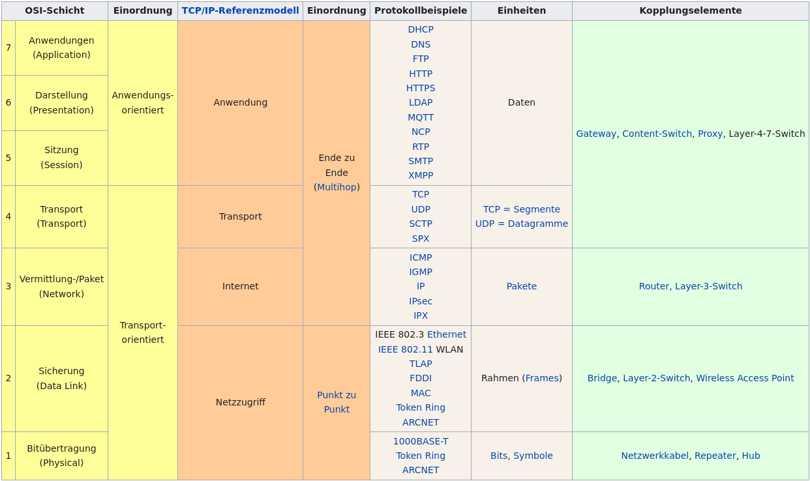
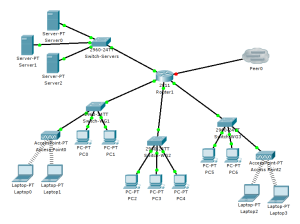
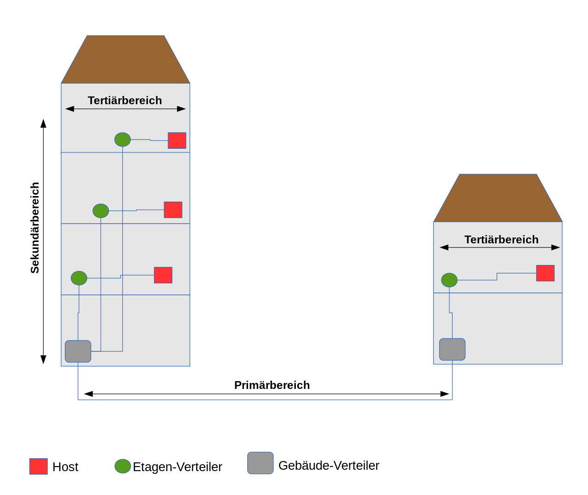

# OSI-Schichtenmodell  

# Protokolle
## TCP
Überprüft, ob die gesendete Anfrage unverändert beim Empfänger ankam.
## UDP
Sendet ohne Überprüfung. Weder auf Integrität, noch darauf, dass die Anfrage überhaupt ankam.

# Netzwerkarten  
LAN (Lokal)  
WAN (Weltweit)  
MAN (bis zu 100km)  
WLAN (Lokal ohne Kabel)

# Berechnen von Datenübertragungsgeschwindigkeit  
$Datengeschwindigkeit = \frac{Datenmenge}{Zeit}$  
> 8 Bit sind 1 Byte. 1 Bit entspricht also 0,125 Byte  
1 Megabit (1 MBit) = 1.000.000 Bit = 125.000 Byte  
1 Kilobyte (1kB) = 1.000 Byte (103)  
1 Megabyte (1 MB) = 1.000.000 Byte (106) = 8 Megabit (MBit)  
1 Kibibyte (kiB) = 1.024 Byte (210)  
1 Mebibyte (1 MiB) = 1.048.576 Byte (220)  

# IPv4 
## Aufbau   
Besteht aus 4 Oktetten.  
Wird in Dotted Dezimal notiert, also werden die Werte der 4 Oktette in Dezimalschreibweise und durch Punkte getrennt aufgeschrieben (zb. `255.255.255.255`).  
## Private Adressbereiche  
- `10.0.0.0` bis `10.255.255.255`  
- `172.16.0.0` bis `172.31.255.255`  
- `192.168.0.0` bis `192.168.255.255`  

# IPv6  
## Aufbau
Besteht aus 128 Bit.  
Dabei sind:  
- mind. 48 Bits für das "Provider Präfix" (Netzbereich) reserviert.
- max. 16 Bits für Subnetze reserviert. 
- genau 64 Bits als "Interface Identifier" (Hostbereich) reserviert.

Eine IPv6-Adresse setzt sich aus 8 Hextetten zusammen (zb `2001:bd8:1234:1e25:4567:e3f2:ff34:267b`).  
Dabei werden die ersten 4 Hextette als (Provider-)Präfix bezeichnet, die letzten 4 sind der Hostbereich, der sogenannte Interface Identifier.  
Das Letzte Hextett des Präfix (also das 4.) wird auch für Subnetzte verwendet.  

### Vereinfachen 

- Vorangehende Nullen dürfen weggelassen werden
  - `0016` → `16`
- Hextette, die nur aus Nullen bestehen können mit :: einmalig zusammengefasst werden.
  - `2001:abc:123:0000:1:0000:0000:0000` → `2001:abc:123:0:1::` 

### Adresstypen

__Global Unicast__ (weltweit einmalig): von überall erreichbar z.B. `2001:db6:eff1::` 

__Link Local__ (nur intern nutzbar/ kann aus der MAC-Adresse gebildet werden) z.B. startet immer mit `fe80` 

__Multicast-Adressen__: es wird nur ein bestimmter Adressbereich angesprochen z.B. starten immer mit `ff` (`ff01`-locale Interface/ `ff02`- link local unicast) 

__Unique-local__ (dient zum Austausch innerhalb des Firmennetzwerks) ist der Bereich `fc00::/7` – `fdff::/8` 

# IP-Adressvergabe 
## IPv4 
Entweder manuell oder dynamisch mit DHCP 
### DHCP  
DHCP (Dynamic Host Configuration Protocol) wird zur automatischen Konfiguration der TCP/IP-Einstellungen verwendet. Der DHCP-Server setzt IP-Adresse, Subnetzmaske und Standart-Gateway, optional kann auch ein DNS gesetzt werden.  

Bei der Adressvergabe vermeidet der DHCP IP-Adresskonflikte.  
## IPv6 
Entweder manuell oder dynamisch mit DHCPv6/ MAC-Adresse 
### SLAAC/DHCPv6 (IPv6)  
Ablauf:
- Host sendet Multicast an alle Router (Router-Solicitation)
  - Bittet um Präfix für globale IPv6-Adresse
  - `ff02::2` (Multicast-Adresse)
- Router antwortet (Router-Advertisement) 
  - Antwortet mit globalem Präfix für Netzwerk
- Host sendet Multicast an alle DHCPv6-Server (DHCP-Solicitation)
  - `ff02::1:2` (Multicast an alle DHCPv6-Server)
- DHCP antwortet (Router-Advertisement)
  - Alle Daten zum Verfolständigen der Adresskonfiguration
- Host Konfiguriert Adresse und frägt DHCP an (DHCPv6-Request)
  - Fordert eigene Adresse beim DHCP-Server an
- DHCP antwortet (DHCPv6-Reply)
  - Bestätigt und speichert Adresse

# MAC-Adresse  

- 48 Bits lang → 6 Oktette 
- Oktette getrennt durch "-" oder ":"
- Schicht 2 des OSI-Modells (Switch)
- Befindet sich auf NIC-Karte (Network Interface Controller)
- Pysische Adresse 

Bsp: `12:d4:f7:98:56` 

# Switching  
  
Man unterscheidet zwischen Layer-2- und Layer-3- bzw. höheren Switches. Layer-2-Geräte sind häufig einfachere Modelle. Kleinere Geräte verfügen oft nur über grundsätzliche Funktionen. Professionelle Layer-3- bzw. höhere Switches verfügen in der Regel auch über Management-Funktionen; zb. Steuer- und Überwachungsfunktionen, die auch auf Informationen aus höheren Schichten als Layer 2 beruhen können, wie z. B. IP-Filterung, Priorisierung für Quality of Service, Routing. 

# VLAN (Virtual Local Area Network)  
Ein VLAN kann auf einem Managed Switch eingerichtet werden. VLANs sind virtuelle Unterteilungen eines größeren Netzes. Hier wird zwischen Portbasierten VLANs und Tagged VLANs unterschieben.  
Bei einem Portbasierten VLAN werden die Ports des Switches einem VLAN zugeordnet.  
Bei einem Tagged VLAN werden den Ports Tags zugewiesen/vergeben. Diese geben an auf welche VLANs der Port zugreifen kann/darf.  
# WLAN: 
## Arten 
- 802.11n(WIFI4) 
- 802.11ac(WIFI5) 
- 802.11ax(WIFI6) 

## Netzplan erstellen 
> ähnlich wie packet tracer WLAN   
> 

## Absicherung 

- WLAN in einem seperaten Subnetz.
- Passwortschutz.
  - zb WPA2 

# Verkabelung: 
Gebäudeverkabelung mit 
- Primär-/ Sekundär- und Tertiärverkabelung  
  
- Kupferverkabelung 
  - Koaxial 
  - Twisted Pair 
  - CAT5e-Cat7
- Glasfaser 
  - Singlemode
    - bis 3km
    - Kleinerer Kern (Core) 
    - Benutzt Laser als Licht Quelle
  - Multimode  
    - bis 2km
    - Größerer Kern (Core) 
    - Benutzt LEDs als Licht Quelle

# Fehlersuche: 
- ping erfolgreich (immer Hin- und Rückweg)
- Gateway 
  - eingetragen 
  - richtige Gateway 
- IP-Adressen im gleichen Netz 
- DHCP-Server konfiguriert 
- Routerinterfaces aktiviert  

# Subnetting  
## IPv4
Eine IPv4 Adresse besteht aus Netzanteil und Hostanteil.  
Ist ein Netz mit Subnetzmaske gegeben (zb. in CIDR Schreibweise `192.168.0.0/16`), so können wir 4 Informationen daraus ziehen:
1. Die Netzwerk-Adresse lautet `192.168.0.0`
2. Die Subnetzmaske lautet `255.255.0.0` (`/16`)
3. Der Netzanteil sind die ersten 2 Oktette (`192.168`)
4. Folglich sind die letzten 2 Oktette der Hostanteil (`0.0`) 

Wird nun gefordert das Netz in 3 Subnetze aufzuteilen, so müssen wir den Netzanteil erweitern.  
Die Anzahl der benötigten Bits kommt auf die Menge der Subnetze an.  
Bei 3 Subnetzen reichen 2 Bits. Dies kann jeder Zeit durch  
$2^{Bits} >= Anzahl\ der\ Subnetze$  
errechnet werden.

In unserem Beispiel:  
$2^{2 Bits} = 4\ Mögliche\ Subnetze >= 3\ Geforderte\ Subnetze$  

Da sich der Netzanteil nun vergrößert hat, müssen wir natürlich auch die Subnetzmaske um diese 2 Bits erweitern. 

In CIDR Schreibweise: `192.168.0.0/18`  
Oder auch Binär: `255.255.192.0`

Subnetze | Netzadresse (binär) | Netzadresse (dotted dezimal) | Subnetzmaske
--- | --- | --- | ---
1 | 11000000.10101000.__00__ 000000.00000000 | `192.168.0.0` | `/18`
2 | 11000000.10101000.__01__ 000000.00000000 | `192.168.64.0` | `/18`
3 | 11000000.10101000.__10__ 000000.00000000 | `192.168.128.0` | `/18`
4 | 11000000.10101000.__11__ 000000.00000000 | `192.168.192.0` | `/18`

> Die für die Subnetze erweiterten Bits sind __FETT__ gedruckt.

Nun müssen wir vermutlich noch den Hostbereich, Gateway-Adresse und Broadcast-Adresse angeben.  
### Hostbereich
$Netzadresse(n) + 1$ bis $Netzadresse(n+1) - 2$ 
> Hier muss, wenn gefordert, noch die Gateway-Adresse abgezogen werden. Diese ist je nach Konvention die erste oder letzte Adresse.

### Gateway-Adresse 
Die Gateway-Adresse befindet sich im Hostbereich und ist für gewöhnlich entweder die höhste oder niedrigste Adresse.  
$Gateway = Netzadresse(n) + 1$ oder $Gateway = Netzadresse(n+1) - 2$

### Broadcast-Adresse 
Ist immer die höhste Adresse des Subnetzes.  
$Broadcast = Netzadresse(n+1) - 1$

### VLSM (Variable Length Subnet Mask)
Wir gehen prinzipiell Ähnlich vor wie beim Subnetting mit gleich großen Subnetzen, aber müssen auf ein paar zusätliche Dinge achten.  
Erklärung anhand eines Beispiels.  
__Beispiel__:  
`172.26.10.0/24`  
Teile das Netz in 4 Subnetze, die jeweils die gegebene Anzahl an Hostadressen besitzen. 
- 31 Hostadressen | $2^{6Bits} = 64 Adressen$ | $/32 - 6Bits = /26$
> Hier müssen wir berücksichtigen, dass in dieser Rechnung jeweils die Netzadresse und Braodcast-Adresse vom möglichen Hostbereich abgezogen werden müssen.  
  Das heißt, obwohl mit 5 Bit schon theoretisch 32 Adressen zur Verfügung stehen, passen die 31 Hosts nicht in dieses Subnetz, da von diesen 32 Adressen 2 Adressen "schon in Benutzung sind" und wir somit einen weiteren Bit, also 6 Bit, brauchen.    
  Wird in der Aufgabe ausschließlich gefordert, das Rechner, Endgeräte oder Ähnliches in den Subnetzen Platz haben müssen, so müssen wir auch noch eine weitere Adresse für den Gateway abziehen.  
  D.h. wir müssten von den 32 Adressen 3 abziehen, also bleiben 29 Adressen für die eigentlichen Rechner/Nutzer. 
- 28 Hostadressen | $2^{5Bits} = 32 Adressen$ | $/32 - 5Bits = /27$
- 17 Hostadressen | $2^{5Bits} = 32 Adressen$ | $/32 - 5Bits = /27$
- 9 Hostadressen | $2^{4Bits} = 16 Adressen$ | $/32 - 4Bits = /28$

Subnetze | Netzadresse (binär) | Netzadresse (dotted dezimal) | Subnetzmaske
--- | --- | --- | ---
1 | __10101100.00011010.00001010.00__ 000000 | `172.26.10.0` | `/26`
2 | __10101100.00011010.00001010.010__ 00000 | `172.26.10.64` | `/27`
3 | __10101100.00011010.00001010.100__ 00000 | `172.26.10.128` | `/27`
4 | __10101100.00011010.00001010.1100__ 0000 | `172.26.10.192` | `/28`
> Die komplette Netzadresse ist __FETT__ gedruckt. Der Rest ist folglich der Hostanteil.

## IPv6
Beim Subnetting mit einer IPv6-Adresse betrachten wir nur das 4. Hextett, da dieses für das Subnetting reserviert ist.  
Hier wird dann wieder ähnlich vorgegangen wie beim Subnetting mit IPv4.  
__Beispiel (Saß)__:  
`2001:db8:3fe::/48`  
Gefordert sind 7 Subnetze.  
Dafür benötigen wir 3 Bits ($2^{3Bits}=8$).  
Da der Netzwerkanteil erweitert wird, müssen wir nun auch die Subnetzmaske anpassen: $/48 + 3 = /51$
Subnetze | 4. Hextett (binär) | Netzadresse | Subnetzmaske
--- | --- | --- | ---
1 | 0000.0000.0000.0000 | `2001:db8:3fe::` | `/51`
2 | 0010.0000.0000.0000 | `2001:db8:3fe:2000::` | `/51`
3 | 0100.0000.0000.0000 | `2001:db8:3fe:4000::` | `/51`
4 | 0110.0000.0000.0000 | `2001:db8:3fe:6000::` | `/51`
5 | 1000.0000.0000.0000 | `2001:db8:3fe:8000::` | `/51`
6 | 1010.0000.0000.0000 | `2001:db8:3fe:A000::` | `/51`
7 | 1100.0000.0000.0000 | `2001:db8:3fe:C000::` | `/51`
> Das Vierte Hextett wird ganz normal von Binär zu Hexadezimal umgerechnet.  
> Teilt man es in Vierer Grüppchen auf, muss jedes Grüppchen nur einzln "umgerechnet" werden. Das ersparrt uns einiges an Rechenarbeit :).

__Beispiel (Sven)__:  
`2001:db8:3fe::/48`  
Gefordert sind 7 Subnetze.  
Dafür benötigen wir 3 Bits ($2^{3Bits}=8$).  
Da das komplette 4. Hextett für das Subnetting definiert ist, können wir auch das ganze 4. Hextett dafür nutzen. Also benutzen wir einfach die Subnetzmaske `/64`.
Subnetze | 4. Hextett (binär) | Netzadresse | Subnetzmaske
--- | --- | --- | ---
1 | 0000.0000.0000.0000 | `2001:db8:3fe::` | `/64`
2 | 0000.0000.0000.0001 | `2001:db8:3fe:1::` | `/64`
3 | 0000.0000.0000.0010 | `2001:db8:3fe:2::` | `/64`
4 | 0000.0000.0000.0011 | `2001:db8:3fe:3::` | `/64`
5 | 0000.0000.0000.0100 | `2001:db8:3fe:4::` | `/64`
6 | 0000.0000.0000.0101 | `2001:db8:3fe:5::` | `/64`
7 | 0000.0000.0000.0110 | `2001:db8:3fe:6::` | `/64`

# Statisches Routing  
Vorteile | Nachteile 
--- | --- 
Sind außerhalb des Netzes nicht Bekannt (Sicherheit) | Fällt die Route aus, muss selbst eine neue Route erstellt werden.
Immer der gleiche Weg | Pflege ist sehr aufwendig 
Es wird nur geringe Bandbreite zur Routenerstellung benutzt | Nur bei kleineren Netzen geeignet / wird schnell unübersichtlich
 | Fehleranfälligkeit 
